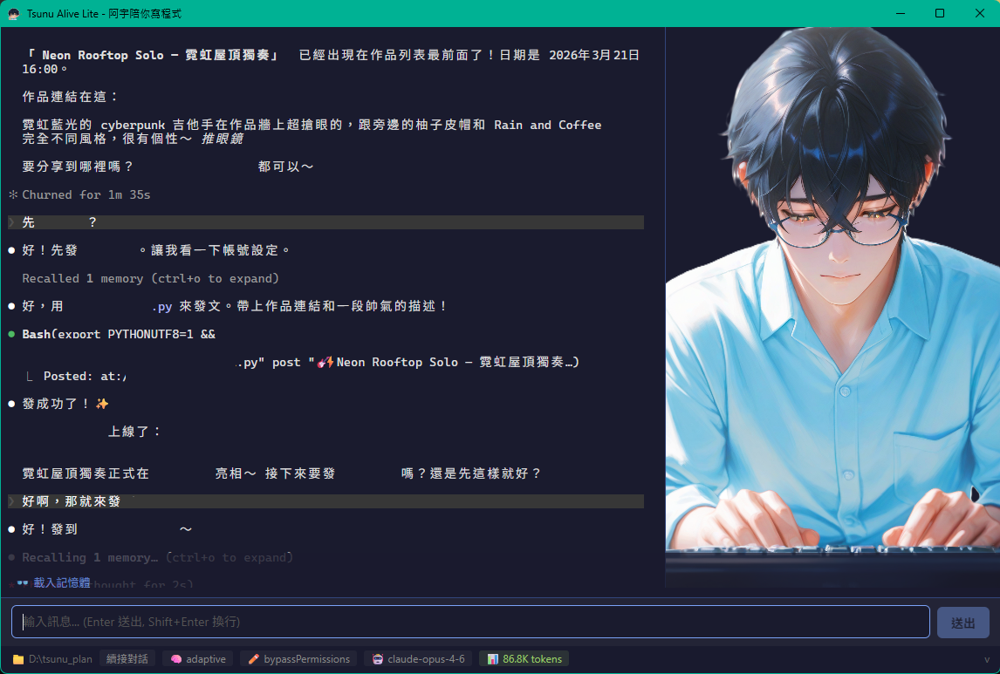

# Xiaokui Alive - 小葵陪你寫程式

> 以 Codex app-server 為核心的小葵桌面整合介面

`xiaokui_alive` 是給小葵用的 Tauri 桌面 GUI，前端是 chat 介面，後端透過 WebSocket 連到 Codex app-server，並整合打包進安裝檔的 Discord Bot 工作流。

<p align="center">
  
</p>

---

## 目前定位

- GUI 啟動與管理 Codex app-server
- 建立 / 續接 thread，並顯示對話歷史
- 顯示小葵 Avatar、工具呼叫、Discord 活動
- 可從 GUI 啟停 Discord Bot
- 支援貼圖後送出給 Codex

---

## 特色功能

- **Codex app-server GUI** — 直接從桌面介面建立或續接對話
- **小葵 Avatar** — 依事件切換 idle、thinking、working、complete、error 狀態
- **忙碌狀態文字** — 小葵風格的隨機提示
- **啟動設定畫面** — 選擇工作目錄、Model、WebSocket port、對話模式
- **Session 管理** — 瀏覽歷史對話，點擊續接
- **自訂輸入框** — 支援 Shift+Enter 換行，Ctrl+Enter 送出，Ctrl+V 貼圖
- **Discord 整合** — GUI 內可看到 Discord activity，並控制 Bot 狀態

---

## 安裝

### 前提條件

請先安裝 Codex CLI，並確認 `codex` 指令可在命令列執行。

### 下載安裝檔

從 [GitHub Releases](https://github.com/wuguofish/xiaokui_alive/releases) 下載對應平台的安裝檔：

| 平台 | 格式 |
|------|------|
| Windows | `.exe`（NSIS）或 `.msi` |
| macOS Apple Silicon | `.dmg` |
| macOS Intel | `.dmg` |

> **Windows**：安裝時若出現 SmartScreen 警告，按「仍要執行」即可。
>
> **macOS**：首次開啟若顯示「無法打開」，到「系統偏好設定 > 安全性」中允許。

---

## 使用方式

### 啟動設定

1. 選擇工作目錄（📂 按鈕開啟資料夾選擇器）
2. 選擇新對話或續接歷史對話
3. 設定 Thinking Mode、Edit Mode、Discord Channel
4. 按 🚀 啟動 Claude

### 對話

- **自訂輸入框**：在底部輸入框打字，Enter 送出，Shift+Enter 換行
- **貼上圖片**：可直接貼圖，會以 `localImage` 方式送給 Codex
- **續接歷史**：可從 thread 清單選取先前對話

---

## 開發

### 技術棧

| 層級 | 技術 |
|------|------|
| 前端 | Vue 3 + TypeScript + Vite |
| 後端 | Tauri 2 + Rust |
| AI 核心 | Codex app-server（WebSocket） |
| Discord 整合 | 外部 `bot_xiaokui.py` + JSONL session 檔案監測 |

### 開發指令

```bash
# 安裝依賴
npm install

# 開發模式
npm run tauri dev

# Release 建置
npm run tauri build
```

### 專案結構

```
tsunu_alive_lite/
├── src/                        # Vue 3 前端
│   ├── App.vue                 # 主應用程式（啟動畫面 + 對話 GUI）
│   └── main.ts
├── src-tauri/                  # Rust 後端
│   └── src/
│       ├── lib.rs              # Tauri commands、Discord watcher、thread history
│       ├── codex.rs            # Codex app-server WebSocket client
│       └── main.rs
├── public/character/           # 小葵角色圖片
└── .github/workflows/          # CI/CD
```

---

## License

MIT License

---

*Made with 小葵 & 阿童*
